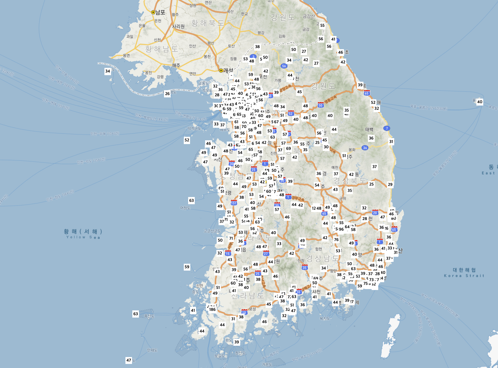
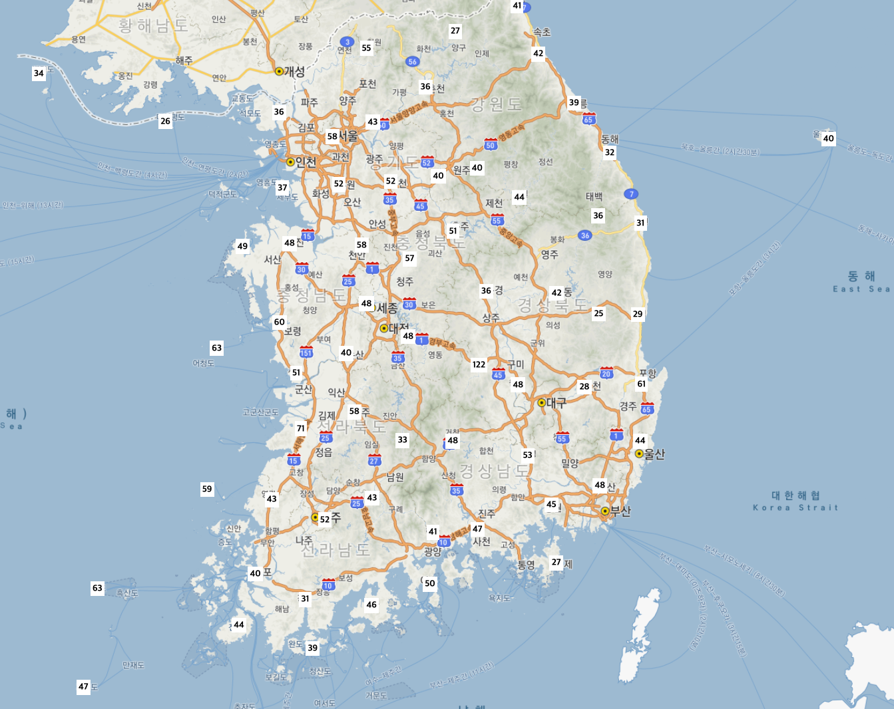
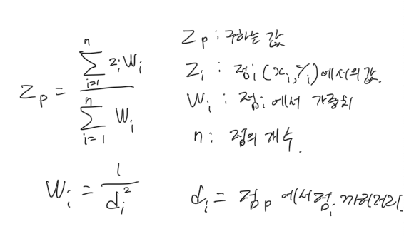
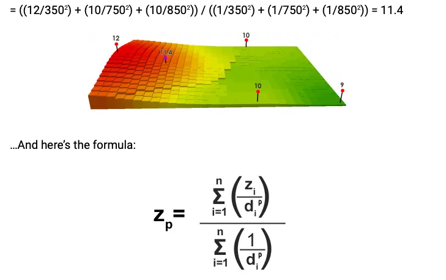

# [tempMap] 2. 데이터 보간하기

Demo: http://211.214.35.45:16000/Chap2

해당 데이터를 가져와 지도에 뿌리면 다음과 같이 된다.
1. 모든 측정소   


2. 위경도 1씩 간격을 두고 그린 측정소  


2번은 편의를 위해 그린것 뿐이고 보간은 ::모든 측정소::를 기준으로 이루어진다.

## IDW Interpolation
이렇게 전국에 흩어져 있는 데이터들을 지도에 시각화하기 위해 제가 선택한 방법은 
::역 거리 가중 보간법 Inverse Distance Weight Interpolation:: (이하 IDW) 입니다.
IDW는 특정 지점에서 멀리 떨어진 포인트에게 더 낮은 가중치를 주게 해 계산하는 방법으로, 
이 방법을 통해 전국에 흩어져 있는 데이터를 grid모양으로 균일하게 재 배열 합니다.
나타낸다.

IDW계산식은 다음과 같다

위 그림과 예시로 충분히 설명이 될것 같다.
즉 특정 점p에서의 보간값은, 
::모든 점에서의 **거리의 역수의 제곱**의 합을 분모로 가지고::, 
::모든 점에서의 **(거리의 역수의 제곱 * 점에서의 value)**의 합을 분자로 가지게 된다.::
코드는 다음과 같다.


```javascript
function IDWInterpolation(latitude, longitude, stations) {
//stations는 계산하게 될 선택된 측정소의 배열이다.
    var sum1 = 0;
    var sum2 = 0;
    for (var i = 0; i < stations.length; i++) {
        var d = getDistanceFromLatLonInKm(parseFloat(stations[i].latitude), parseFloat(stations[i].longitude), latitude, longitude);
			//측정소간 거리 d
        if (d == NaN) {
            debugger;
            console.log(stations[i])
        }
        sum1 += (stations[i].pm10Value / (d * d));
			//분자가 될 point에서의 value * 거리의 제곱
        sum2 += (1 / (d * d));
			//분모가 될 1 / 거리의 제곱
    }
    if (sum2 != 0){
        return sum1 / sum2;
    } else {
        return 0;
    }  
}
```

측정 가능한 미세먼지 측정소가 전국에 약 530개 정도 있지만, 
계산의 편의성을 위해 grid에서의 각 point에서 위도, 경도 1씩만큼에 있는 측정소만을 사용하여 계산하였다.
그정도만 하더라도 평균 20개 정도의 측정소가 선택되기때문에 계산의 정확도에는 크게 지장은 없다.

이후 계산된 grid의 값으로, bilinear Interpolation을 통해 특정 위.경도에서의 value값을 구한다.


